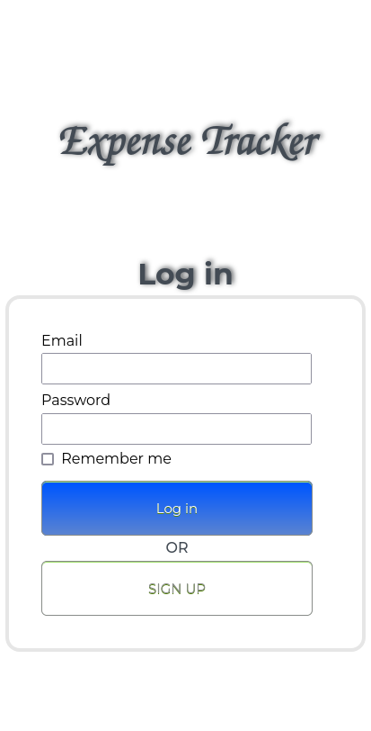

# ROR: Expense Tracker 

> ROR app to track the expenses.

)
 Application buit with Ruby on Rails

## Live demo
[www.ExpenseTracker.com](https://gentle-headland-22451.herokuapp.com)

## Built With

- Major languages: Ruby
- Frameworks: ROR
- Gems: devise,RSpec

## Getting Started

To get a local copy up and running follow these simple example steps.

### Prerequisites

You need to have followings installed in your local machine:
- `Ruby`
- `Postgresql`
- `Rails`
- `RSpec`
- `node.js`

### Setup

To setup the project in your local, in the repo page: 
- click on code (dropdown list) > Download as ZIP. 
- or open terminal of path you want to install project and run this command:
`git clone https://github.com/sj1978/budget-app.git`
- `cd ebudget-app/`
- `bundle install`
- `bin/rails db:create`
- `bin/rails db:migrate`

## Instruction on the usage
- Run the following comands in your command line:
- `rails s`
- `open any chrome/firefox`
- `type "localhost:3000"`
- `enjoy the app`

## Tests
- To run tests for current app, please run below commands in your terminal:
- `cd budget-app/`
- `rspec spec spec/test_file_name`

## Author

👤 **Anibal Amoroso**

- GitHub: [@sj1978](https://github.com/sj1978)
- LinkedIn: [LinkedIn](https://linkedin.com/in/anibalamoroso/)

## 🤝 Contributing

Contributions, issues, and feature requests are welcome!

Feel free to check the [issues page](https://github.com/sj1978/budget-app/issues).

## Show your support

Give a ⭐️ if you like this project!

## Acknowledgments

- This is app built withing the frames of CAPSTONE project of Rails Module at **[Microverse](https://www.microverse.org/)**, a remote web-developer school, using their support and frameworks provided. 
Original design idea by [Gregoire Vella](https://www.behance.net/gregoirevella)

## 📝 License

This project is [MIT](./MIT.md) licensed.